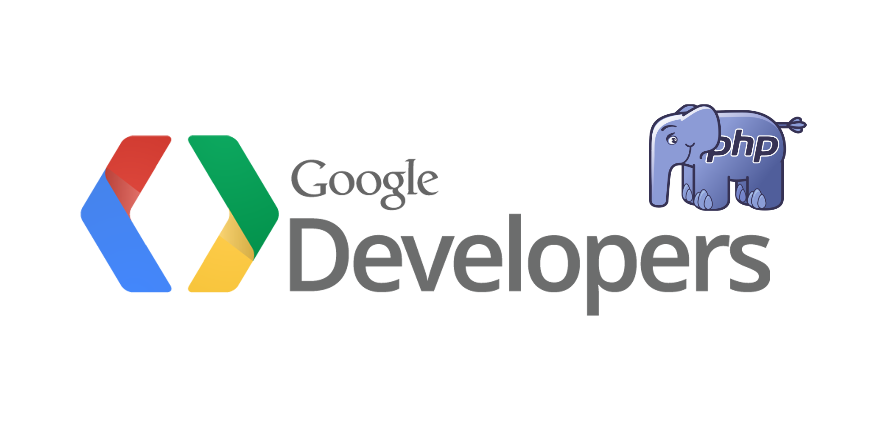

# PHP Google Search Console API Client & XML Data Parser

Elevate your PHP applications by effortlessly integrating Google services with this client. Designed for seamless connectivity with Google APIs, it facilitates comprehensive data exchange and features an XML data parser.

The client is mainly built for PHP environments, making it ideal for use with Laravel, Symfony, WordPress, PrestaShop, and plenty of others heavy php framework projects. It's crafted to seamlessly integrate into these ecosystems, enabling developers to access Google APIs with ease. Adjust accordingly to your needs. 

In this particular client, we use existing Google Search Console data in order to obtain the number of clicks, position rankings, click-through rates, and the most impactful keywords for our websites.

## Getting Started

Follow these steps to set up the script in your PHP environment, including cloning the repository and installing dependencies.

### Prerequisites

Ensure PHP and Composer are installed on your server and machine. These are vital for dependency management and script execution.

- PHP: [Installation Guide](https://www.php.net/manual/en/install.php)
- Composer: [Getting Started Guide](https://getcomposer.org/doc/00-intro.md)

### Cloning the Repository

Clone the repository to your machine or server:

```bash
git clone https://github.com/ricardomrcruz/PHP_Google_API_Client.git
cd PHP_Google_API_Client
```

### Installing Dependencies

After cloning, install PHP dependencies with:

```bash
composer require google/apiclient:^2.0
```

For specific dependency versions, use the project's `composer.lock`:

```bash
composer install
```

To update dependencies:

```bash
composer update
```

**Note:** Commit your `composer.lock` to version control to synchronize dependency versions across environments.

### Configuring Google Client

Set up your Google Client:

1. Visit the [Google Developers Console](https://console.developers.google.com/).
2. Create or select a project.
3. Under "Credentials", create your project's credentials (e.g., OAuth 2.0 Client IDs).
4. Enable necessary APIs via the "Library" page. Specifically, add the Google Search Console API.
5. Configure your OAuth 2.0 Client ID credentials with appropriate domains and redirect URLs.
6. Download the client ID JSON file and upload it to your project folder.
7. Delete the refresh access token that comes with the repository. Enter your query URL. Confirm your Google identity and watch your new refresh token get added to the project automatically.

These additional steps ensure that your Google Client is fully configured and ready to use within your project. They also guide you through the process of handling authentication and obtaining the necessary credentials for accessing Google APIs.

### API Scopes

Include the correct scopes in your authentication flow as per the [Google Identity Platform documentation](https://developers.google.com/identity/protocols/oauth2/scopes).

### Additional Information

For troubleshooting, contribution guidelines, or license information, feel free to add relevant sections.

---

#### Courtesy of [Strasbourg Web Solutions](https://strasbourgwebsolutions.fr) | Open Source 4 Life


